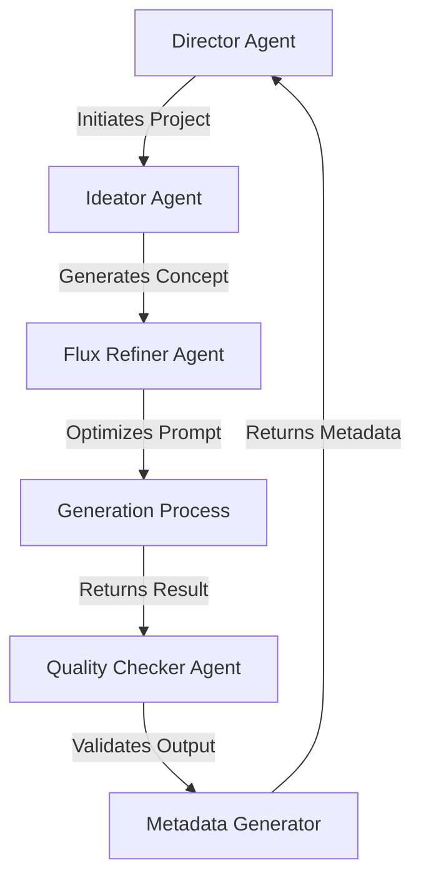

# Refactoring Guide

## 1. Configuration Standardization

### Current Issues
- Inconsistent inference steps (200 vs 28)
- Inconsistent dimensions (1024x1024 vs 768x768)
- Unclear which settings are defaults vs model-specific
- Scattered configuration across multiple files
- Unclear multi-agent system interactions and responsibilities

### Solution: Centralized Configuration

```typescript
// src/config/generationConfig.ts
interface ModelConfig {
  inferenceSteps: number;
  guidanceScale: number;
  dimensions: {
    width: number;
    height: number;
  };
}

interface GenerationConfig {
  default: ModelConfig;
  models: {
    [key: string]: ModelConfig;
  };
}

export const generationConfig: GenerationConfig = {
  default: {
    inferenceSteps: 200,
    guidanceScale: 35,
    dimensions: {
      width: 1024,
      height: 1024
    }
  },
  models: {
    "black-forest-labs/flux-1.1-pro": {
      inferenceSteps: 28,    // Optimized for FLUX
      guidanceScale: 3,      // FLUX-specific
      dimensions: {
        width: 2048,          // FLUX optimal dimension
        height: 2048          // FLUX optimal dimension
      }
    }
  }
};
```

## 2. Multi-Agent System Logging

### Agent Types and Responsibilities

```typescript
// src/types/agents.ts
interface Agent {
  id: string;
  role: AgentRole;
  status: AgentStatus;
}

enum AgentRole {
  DIRECTOR = 'director',
  IDEATOR = 'ideator',
  FLUX_REFINER = 'flux_refiner',
  QUALITY_CHECKER = 'quality_checker',
  METADATA_GENERATOR = 'metadata_generator'
}
```

### Agent Interaction Logging

```typescript
// src/utils/agentLogger.ts
export class AgentLogger {
  static logAgentAction(agent: Agent, action: string, details: string) {
    console.log(`\n┌─── ${agent.role.toUpperCase()} Agent (${agent.id}) ───┐`);
    console.log(`│ Action: ${action}`);
    console.log(`│ Details: ${details}`);
    console.log(`└${'─'.repeat(40)}┘`);
  }

  static logAgentInteraction(from: Agent, to: Agent, message: string) {
    console.log(`\n↓ ${from.role} → ${to.role}`);
    console.log(`└── ${message}`);
  }
}
```

## 3. Enhanced Terminal Output

### Current Output Issues
- Unclear agent interactions
- Mixed configuration and progress information
- Lack of visual hierarchy
- Difficult to track multi-agent workflow

### Proposed New Output Structure

```typescript
// src/utils/logger.ts
export class Logger {
  static printHeader(text: string) {
    console.log('\n' + '═'.repeat(50));
    console.log(`  ${text}`);
    console.log('═'.repeat(50) + '\n');
  }

  static printAgentSection(agent: Agent) {
    console.log(`\n┌─── ${agent.role.toUpperCase()} ───────────────┐`);
  }

  static printConfig(config: ModelConfig) {
    console.log(`│ Model Settings:`);
    console.log(`│ ├── Dimensions: ${config.dimensions.width}x${config.dimensions.height}`);
    console.log(`│ ├── Inference Steps: ${config.inferenceSteps}`);
    console.log(`│ └── Guidance Scale: ${config.guidanceScale}`);
  }

  static printAgentStatus(agent: Agent, status: string) {
    const timestamp = new Date().toISOString().split('T')[1].slice(0, -1);
    console.log(`│ [${timestamp}] ${agent.role}: ${status}`);
  }
}
```

### Example Multi-Agent Output

```
═══════════════════════════════════════════════════════
  IKIGAI Art Generation
═══════════════════════════════════════════════════════

┌─── DIRECTOR Agent (fb46c564) ───────────────┐
│ Action: Project Initialization
│ Details: Starting new art generation project
└────────────────────────────────────────────────┘

↓ director → ideator
└── Requesting initial concept generation

┌─── IDEATOR Agent (38db8025) ───────────────┐
│ Action: Concept Generation
│ Details: Creating initial artwork concept
└────────────────────────────────────────────────┘

┌─── FLUX_REFINER Agent (dd3503f4) ───────────┐
│ Action: Prompt Refinement
│ Details: Optimizing prompt for FLUX model
└────────────────────────────────────────────────┘

┌─── Generation Settings ───────────────────────┐
│ Model: black-forest-labs/flux-1.1-pro
│ Dimensions: 768x768
│ Inference Steps: 28
│ Guidance Scale: 3
└────────────────────────────────────────────────┘

┌─── Generation Progress ────────────────────────┐
│ ⏳ Generating prompt...
│ ✓ Prompt generated
│ ⏳ Creating artwork...
│ ✓ Artwork complete
└────────────────────────────────────────────────┘
```

## 4. Implementation Steps

1. **Configuration Refactor**
   - Create `src/config` directory
   - Add `generationConfig.ts`
   - Update all services to use centralized config

2. **Agent System Logging**
   - Create `src/types/agents.ts`
   - Add `agentLogger.ts`
   - Implement agent interaction tracking

3. **Logger Implementation**
   - Create `src/utils/logger.ts`
   - Replace console.log calls with structured logging
   - Add agent-specific logging methods

4. **Service Updates**
   ```typescript
   // src/services/artGeneration.ts
   import { Logger } from '../utils/logger';
   import { AgentLogger } from '../utils/agentLogger';
   
   export class ArtGenerationService {
     private director: Agent;
     private ideator: Agent;
     private fluxRefiner: Agent;
     
     async generateArt(prompt: string) {
       Logger.printHeader('IKIGAI Art Generation');
       
       // Director initiates the process
       AgentLogger.logAgentAction(
         this.director,
         'Project Initialization',
         'Starting new art generation project'
       );
       
       // Agent interactions
       AgentLogger.logAgentInteraction(
         this.director,
         this.ideator,
         'Requesting initial concept generation'
       );
       
       // Continue with generation process...
     }
   }
   ```

## 5. Benefits

- **Clear Agent Roles**: Each agent's responsibilities and actions are clearly visible
- **Traceable Interactions**: Agent communication flow is easy to follow
- **Consistent Configuration**: All settings in one place
- **Visual Hierarchy**: Better organized and more readable terminal output
- **Debugging**: Easier to identify where issues occur in the multi-agent system
- **Time Tracking**: Timestamps for agent actions

## 6. Future Improvements

- Add color coding for different agent types
- Implement detailed agent state tracking
- Add performance metrics for each agent
- Create agent interaction diagrams
- Add configuration validation
- Implement agent failure recovery logging

## 7. Migration Guide

1. Create new configuration and logger files
2. Update agent system to use new logging
3. Test each agent's logging implementation
4. Remove old console.log statements
5. Update tests to use new logging system
6. Document agent interaction patterns

## 8. Agent Interaction Flow



This diagram shows the typical flow of information between agents in the system.

## 9. Character Naming and Metadata Enhancement

### Current Issues
- Basic metadata without character personality
- Missing creative naming based on prompt elements
- Limited character backstory
- No personality traits derived from visual elements
- Missing narrative elements

### Solution: Character Generation Pipeline

```typescript
// src/agents/naming/types.ts
interface CharacterNamingAgent extends Agent {
  role: 'character_namer';
  generateName(prompt: string): Promise<CharacterIdentity>;
}

interface CharacterIdentity {
  name: string;           // e.g., "Professor Harmony Bearington III"
  title: string;          // e.g., "The Musical Farmer"
  nickname?: string;      // e.g., "The Cultivating Conductor"
  personality: string[];  // e.g., ["Distinguished", "Creative", "Nurturing"]
  backstory: string;      // Brief character background
  reasoning: string;      // Why this name was chosen
}

// src/agents/naming/bearNamingAgent.ts
class BearCharacterNamer implements CharacterNamingAgent {
  role = 'character_namer';
  
  async generateName(prompt: string): Promise<CharacterIdentity> {
    // Extract key elements from prompt
    const elements = await this.analyzePrompt(prompt);
    
    // Generate rich character identity
    return {
      name: this.generateNameFromElements(elements),
      title: this.generateTitle(elements),
      nickname: this.generateNickname(elements),
      personality: this.derivePersonality(elements),
      backstory: this.createBackstory(elements),
      reasoning: this.explainNameChoice(elements)
    };
  }
}
```

### Enhanced Metadata Structure

```typescript
interface EnhancedMetadata {
  // Character Identity
  character: {
    name: string;
    title: string;
    nickname?: string;
    personality: string[];
    backstory: string;
  };

  // Visual Elements
  appearance: {
    attire: string[];
    accessories: string[];
    expression: string;
    pose: string;
  };

  // Artistic Style
  style: {
    primary: string;
    influences: string[];
    techniques: string[];
    mood: string;
  };

  // Generation Context
  technical: {
    model: string;
    settings: ModelConfig;
    prompt: string;
    timestamp: string;
  };
}
```

### Example Output

```json
{
  "character": {
    "name": "Professor Harmony Bearington III",
    "title": "The Musical Farmer",
    "nickname": "The Cultivating Conductor",
    "personality": [
      "Distinguished",
      "Innovative",
      "Nurturing",
      "Artistic"
    ],
    "backstory": "Born into a family of classical musicians, Harmony discovered a passion for sustainable agriculture during his travels. Now he conducts symphonies in his urban rooftop garden, believing that both music and plants thrive on careful cultivation."
  },
  "appearance": {
    "attire": [
      "Classical Performer's Hat",
      "Urban Farmer's Overalls",
      "Formal State Collar"
    ],
    "accessories": [
      "Musical Notation Book",
      "Occult Symbols"
    ],
    "expression": "Dignified contemplation",
    "pose": "Distinguished profile"
  },
  "style": {
    "primary": "Surrealism",
    "influences": [
      "René Magritte",
      "Belgian Art Movement"
    ],
    "techniques": [
      "Precise Edge Definition",
      "Symbolic Juxtaposition"
    ],
    "mood": "Mysterious yet dignified"
  },
  "technical": {
    "model": "black-forest-labs/flux-1.1-pro",
    "settings": {
      "inferenceSteps": 28,
      "guidanceScale": 3,
      "dimensions": {
        "width": 2048,
        "height": 2048
      }
    },
    "prompt": "a distinguished bear portrait in profile wearing...",
    "timestamp": "2024-03-19T14:23:45.789Z"
  }
}
```

### Implementation Steps

1. **Character Generation System**
   - Create character naming agent
   - Implement prompt analysis for character elements
   - Build name generation logic
   - Add personality trait detection
   - Implement backstory generation

2. **Metadata Enhancement**
   - Update metadata structure
   - Add character identity section
   - Enhance visual element detection
   - Improve style classification
   - Add technical details

3. **Integration**
   - Connect character generation to main pipeline
   - Update metadata generation process
   - Add character details to NFT metadata
   - Implement metadata validation

### Benefits

1. **Richer Character Identity**
   - Meaningful names based on visual elements
   - Consistent character backstories
   - Personality traits tied to appearance
   - Creative titles and nicknames

2. **Enhanced Metadata**
   - Detailed character information
   - Comprehensive style analysis
   - Complete technical documentation
   - Rich visual element description

3. **Improved User Experience**
   - More engaging character descriptions
   - Better storytelling elements
   - Deeper artwork context
   - Enhanced collectible value

4. **Collection Cohesion**
   - Connected character narratives
   - Consistent naming patterns
   - Related backstories
   - Thematic connections

### Future Enhancements

1. **Character Relationships**
   - Generate connections between characters
   - Create family trees
   - Establish social networks
   - Define character roles in society

2. **Dynamic Storytelling**
   - Generate character-specific stories
   - Create collection lore
   - Build world history
   - Develop character arcs

3. **Interactive Elements**
   - Character development system
   - Story progression
   - Achievement tracking
   - Character evolution 

## 10. Thirdweb Integration

### Current Issues
- Metadata format not compatible with thirdweb
- Need to organize images and metadata for batch minting
- Missing standardized trait structure
- No automated export pipeline

### Solution: Thirdweb Export Pipeline

```typescript
// src/exporters/thirdweb/types.ts
interface ThirdwebMetadata {
  name: string;
  description: string;
  image: string;
  attributes: {
    trait_type: string;
    value: string;
  }[];
}

// src/exporters/thirdweb/metadataExporter.ts
class ThirdwebMetadataExporter {
  async exportCollection(
    artworks: EnhancedMetadata[],
    outputDir: string
  ) {
    // Create output directories
    const imagesDir = path.join(outputDir, 'images');
    await fs.mkdir(imagesDir, { recursive: true });
    
    // Transform our metadata to Thirdweb format
    const thirdwebMetadata = artworks.map((artwork, index) => ({
      name: `${artwork.character.name} #${index + 1}`,
      description: this.generateDescription(artwork),
      image: `ipfs://NewUriToReplace/${index + 1}.png`,
      attributes: this.transformAttributes(artwork)
    }));

    // Save images with sequential numbering
    await Promise.all(artworks.map((artwork, index) => 
      this.saveImage(artwork.technical.imageUrl, 
        path.join(imagesDir, `${index + 1}.png`)
      )
    ));

    // Save metadata JSON
    await fs.writeFile(
      path.join(outputDir, 'metadata.json'),
      JSON.stringify(thirdwebMetadata, null, 2)
    );
  }

  private transformAttributes(metadata: EnhancedMetadata) {
    return [
      // Character traits
      {
        trait_type: "Title",
        value: metadata.character.title
      },
      // Appearance traits
      ...metadata.appearance.attire.map(item => ({
        trait_type: "Attire",
        value: item
      })),
      ...metadata.appearance.accessories.map(item => ({
        trait_type: "Accessory",
        value: item
      })),
      // Style traits
      {
        trait_type: "Style",
        value: metadata.style.primary
      },
      ...metadata.style.influences.map(influence => ({
        trait_type: "Artistic Influence",
        value: influence
      })),
      // Personality traits
      ...metadata.character.personality.map(trait => ({
        trait_type: "Personality",
        value: trait
      }))
    ];
  }

  private generateDescription(metadata: EnhancedMetadata): string {
    return `${metadata.character.name}, ${metadata.character.title.toLowerCase()}. ${metadata.character.backstory}`;
  }
}
```

### Example Output Structure

```
collection/
├── images/
│   ├── 1.png
│   ├── 2.png
│   └── ...
└── metadata.json
```

### Example Metadata JSON

```json
[
  {
    "name": "Professor Harmony Bearington III #1",
    "description": "Professor Harmony Bearington III, the musical farmer. Born into a family of classical musicians, Harmony discovered a passion for sustainable agriculture during his travels...",
    "image": "ipfs://NewUriToReplace/1.png",
    "attributes": [
      {
        "trait_type": "Title",
        "value": "The Musical Farmer"
      },
      {
        "trait_type": "Attire",
        "value": "Classical Performer's Hat"
      },
      {
        "trait_type": "Attire",
        "value": "Urban Farmer's Overalls"
      },
      {
        "trait_type": "Accessory",
        "value": "Musical Notation Book"
      },
      {
        "trait_type": "Style",
        "value": "Surrealism"
      },
      {
        "trait_type": "Artistic Influence",
        "value": "René Magritte"
      },
      {
        "trait_type": "Personality",
        "value": "Distinguished"
      },
      {
        "trait_type": "Personality",
        "value": "Innovative"
      }
    ]
  }
]
```

### Implementation Steps

1. **Setup Export Pipeline**
   - Create ThirdwebMetadataExporter class
   - Implement metadata transformation
   - Add image processing utilities
   - Create output directory structure

2. **Metadata Transformation**
   - Map our metadata to thirdweb format
   - Generate sequential numbering
   - Transform attributes to trait_type/value pairs
   - Create descriptive text

3. **Image Processing**
   - Copy and rename images sequentially
   - Ensure proper image format
   - Optimize for IPFS storage

4. **Quality Checks**
   - Validate metadata format
   - Check image integrity
   - Verify IPFS compatibility
   - Test with thirdweb SDK

### Benefits

1. **Standardized Format**
   - Compatible with thirdweb platform
   - Consistent trait structure
   - Organized collection files
   - Ready for batch minting

2. **Rich Metadata**
   - Character traits preserved
   - Detailed attributes
   - Comprehensive descriptions
   - Organized trait categories

3. **Easy Integration**
   - Direct thirdweb compatibility
   - Batch processing support
   - Automated export process
   - Simple folder structure

### Future Enhancements

1. **IPFS Integration**
   - Direct IPFS upload
   - URI management
   - Hash verification
   - Metadata pinning

2. **Collection Management**
   - Rarity calculation
   - Trait distribution
   - Collection analytics
   - Batch updates

3. **Minting Automation**
   - Direct thirdweb SDK integration
   - Batch minting scripts
   - Gas optimization
   - Error recovery 

## 11. Preview and Curation System

### Current Issues
- No way to preview generated images before minting
- Can't select/reject specific generations
- No bulk generation review interface
- No way to organize selected/rejected images
- Missing batch processing workflow

### Solution: Curation Pipeline

```typescript
// src/curators/types.ts
interface CurationSystem {
  status: 'pending' | 'approved' | 'rejected';
  previewUrl: string;
  metadata: EnhancedMetadata;
  generationId: string;
  curatedAt?: Date;
  notes?: string;
}

// src/curators/previewServer.ts
class PreviewServer {
  private port: number = 3333;
  private generations: Map<string, CurationSystem> = new Map();

  async start() {
    const app = express();
    
    app.get('/', (req, res) => {
      // Render gallery view of all generations
      res.send(this.renderGallery());
    });

    app.post('/curate/:id', (req, res) => {
      const { status, notes } = req.body;
      this.updateStatus(req.params.id, status, notes);
    });

    app.listen(this.port, () => {
      console.log(`
╭───────────────────────────────────╮
│   Preview Server Running          │
│   http://localhost:${this.port}        │
│                                   │
│   View and curate generations     │
│   Press Ctrl+C when finished      │
╰───────────────────────────────────╯
      `);
    });
  }

  private renderGallery(): string {
    // Render HTML with preview cards for each generation
    return `
      <html>
        <head>
          <title>IKIGAI Generation Preview</title>
          <style>
            .gallery { display: grid; grid-template-columns: repeat(auto-fill, minmax(300px, 1fr)); gap: 20px; }
            .card { border: 1px solid #ccc; padding: 15px; }
            .approved { border-color: green; }
            .rejected { border-color: red; }
            .pending { border-color: orange; }
          </style>
        </head>
        <body>
          <div class="gallery">
            ${[...this.generations.entries()]
              .map(([id, gen]) => this.renderCard(id, gen))
              .join('')}
          </div>
          <script>
            function approve(id) {
              updateStatus(id, 'approved');
            }
            function reject(id) {
              updateStatus(id, 'rejected');
            }
            function updateStatus(id, status) {
              fetch('/curate/' + id, {
                method: 'POST',
                headers: { 'Content-Type': 'application/json' },
                body: JSON.stringify({ 
                  status,
                  notes: document.querySelector(`#notes-${id}`).value 
                })
              }).then(() => location.reload());
            }
          </script>
        </body>
      </html>
    `;
  }

  private renderCard(id: string, generation: CurationSystem): string {
    return `
      <div class="card ${generation.status}">
        
        <h3>${generation.metadata.character.name}</h3>
        <p>${generation.metadata.character.title}</p>
        <div class="actions">
          <button onclick="approve('${id}')">Approve</button>
          <button onclick="reject('${id}')">Reject</button>
          <textarea id="notes-${id}" placeholder="Notes">${generation.notes || ''}</textarea>
        </div>
      </div>
    `;
  }
}
```

### Bulk Generation Script

```typescript
// src/scripts/bulkGenerate.ts
async function bulkGenerate(count: number) {
  const preview = new PreviewServer();
  const generator = new ArtGenerator();
  
  // Start preview server
  await preview.start();
  
  // Generate requested number of images
  for (let i = 0; i < count; i++) {
    Logger.printHeader(`Generating Art ${i + 1}/${count}`);
    
    const result = await generator.generate();
    preview.addGeneration({
      status: 'pending',
      previewUrl: result.imageUrl,
      metadata: result.metadata,
      generationId: `gen_${i}`
    });
  }
  
  // Wait for curation to complete
  await preview.waitForCompletion();
  
  // Get approved generations
  const approved = preview.getApprovedGenerations();
  
  // Export to thirdweb format
  const exporter = new ThirdwebMetadataExporter();
  await exporter.exportCollection(
    approved.map(g => g.metadata),
    './output/thirdweb-collection'
  );
}
```

### Usage Example

```bash
# Generate 10 images for review
pnpm start:bulk 10
```

### Preview Interface

```
╭───────────────────────────────────╮
│   Bulk Generation Preview         │
├───────────────────────────────────┤
│                                   │
│   Generating 10 images...         │
│   Preview at:                     │
│   http://localhost:3333           │
│                                   │
│   Progress: [██████----] 6/10     │
╰───────────────────────────────────╯
```

### Implementation Steps

1. **Preview Server**
   - Create express server for previews
   - Implement gallery view
   - Add curation controls
   - Setup real-time updates

2. **Bulk Generation**
   - Add bulk generation script
   - Implement progress tracking
   - Connect to preview server
   - Handle interruptions

3. **Curation System**
   - Add approval/rejection logic
   - Implement notes system
   - Save curation decisions
   - Track curation history

4. **Export Integration**
   - Filter approved generations
   - Update numbering system
   - Maintain selected order
   - Export curated collection

### Benefits

1. **Better Quality Control**
   - Visual preview of generations
   - Immediate curation workflow
   - Notes for rejected items
   - Batch processing efficiency

2. **Improved Workflow**
   - Real-time preview
   - Bulk generation support
   - Interactive curation
   - Progress tracking

3. **Collection Management**
   - Only approved items exported
   - Maintained generation order
   - Curation history
   - Quality assurance

### Future Enhancements

1. **Advanced Preview Features**
   - Side-by-side comparison
   - Trait filtering
   - Bulk actions
   - Preview customization

2. **Curation Tools**
   - Rating system
   - Custom categories
   - Batch operations
   - Curation templates

3. **Integration Options**
   - Remote preview sharing
   - Team curation support
   - API integration
   - Automated quality checks 

## 12. Generation Feedback Loop System

### Current Issues
- No learning from previous generations
- Can't leverage curation decisions
- Missing quality improvement cycle
- No historical quality tracking
- No automated prompt refinement

### Solution: Adaptive Learning Pipeline

```typescript
// src/feedback/types.ts
interface GenerationFeedback {
  generationId: string;
  status: 'approved' | 'rejected';
  qualityMetrics: QualityMetrics;
  curatorNotes: string;
  prompt: string;
  metadata: EnhancedMetadata;
  imageUrl: string;
  timestamp: Date;
}

interface FeedbackAnalysis {
  successfulPrompts: Array<{
    prompt: string;
    score: number;
    patterns: string[];
  }>;
  failedPrompts: Array<{
    prompt: string;
    issues: string[];
    improvements: string[];
  }>;
  stylePatterns: {
    positive: string[];
    negative: string[];
  };
}

// src/feedback/learningSystem.ts
class GenerationLearningSystem {
  private feedbackDB: Collection<GenerationFeedback>;
  private promptOptimizer: PromptOptimizer;
  
  async learn(feedback: GenerationFeedback) {
    // Store feedback
    await this.feedbackDB.insert(feedback);
    
    // Analyze patterns
    const analysis = await this.analyzeFeedback();
    
    // Update prompt generation
    await this.promptOptimizer.updatePatterns(analysis);
    
    // Update quality thresholds
    await this.updateQualityThresholds(analysis);
  }

  private async analyzeFeedback(): Promise<FeedbackAnalysis> {
    const recentFeedback = await this.feedbackDB
      .find()
      .sort({ timestamp: -1 })
      .limit(100)
      .toArray();

    return {
      successfulPrompts: this.analyzeSuccessfulPrompts(recentFeedback),
      failedPrompts: this.analyzeFailedPrompts(recentFeedback),
      stylePatterns: this.analyzeStylePatterns(recentFeedback)
    };
  }
}

// src/feedback/promptOptimizer.ts
class PromptOptimizer {
  private patterns: {
    successful: Set<string>;
    problematic: Set<string>;
  };

  async optimizePrompt(basePrompt: string): Promise<string> {
    // Apply learned patterns
    let optimizedPrompt = basePrompt;
    
    // Enhance with successful patterns
    for (const pattern of this.patterns.successful) {
      optimizedPrompt = this.enhancePrompt(optimizedPrompt, pattern);
    }
    
    // Remove problematic patterns
    for (const pattern of this.patterns.problematic) {
      optimizedPrompt = this.removePattern(optimizedPrompt, pattern);
    }
    
    return optimizedPrompt;
  }
}
```

### Enhanced Bulk Generation Flow

```typescript
// src/scripts/bulkGenerate.ts
class AdaptiveBulkGenerator {
  private learningSystem: GenerationLearningSystem;
  private promptOptimizer: PromptOptimizer;
  private qualityTracker: QualityTracker;

  async generateBatch(count: number) {
    const preview = new PreviewServer();
    await preview.start();

    // Initialize with historical learning
    await this.learningSystem.initialize();

    for (let i = 0; i < count; i++) {
      // Get optimized prompt
      const basePrompt = await this.generateBasePrompt();
      const optimizedPrompt = await this.promptOptimizer.optimizePrompt(basePrompt);

      // Generate with quality checks
      const result = await this.generateWithQuality(optimizedPrompt);

      // Add to preview
      preview.addGeneration({
        status: 'pending',
        previewUrl: result.imageUrl,
        metadata: result.metadata,
        generationId: `gen_${i}`,
        qualityMetrics: result.metrics
      });

      // Real-time learning from previous generations
      if (i > 0) {
        await this.learningSystem.learn(preview.getLastFeedback());
      }
    }

    // Wait for curation
    const curatedResults = await preview.waitForCompletion();

    // Learn from batch
    await this.learningSystem.learnFromBatch(curatedResults);

    // Export approved items
    await this.exportApproved(curatedResults);
  }
}
```

### Quality Tracking Dashboard

```typescript
// src/feedback/qualityTracker.ts
class QualityTracker {
  async trackMetrics(generation: GenerationResult) {
    const metrics = await this.calculateMetrics(generation);
    await this.storeMetrics(metrics);
    await this.updateTrends();
    
    return {
      current: metrics,
      trends: await this.getTrends(),
      improvements: await this.getImprovementSuggestions()
    };
  }
}
```

### Example Usage

```bash
# Generate with learning enabled
pnpm start:bulk 10 --learn

# View quality trends
pnpm quality:trends

# Export learning insights
pnpm export:insights
```

### Implementation Steps

1. **Feedback Collection**
   - Store generation results
   - Track curation decisions
   - Collect quality metrics
   - Save curator notes

2. **Pattern Analysis**
   - Analyze successful generations
   - Identify problematic patterns
   - Extract style consistencies
   - Track quality trends

3. **Learning System**
   - Implement pattern recognition
   - Create prompt optimization
   - Build quality tracking
   - Setup feedback database

4. **Integration**
   - Connect to bulk generation
   - Add real-time learning
   - Implement quality checks
   - Create monitoring dashboard

### Benefits

1. **Continuous Improvement**
   - Learning from successes
   - Avoiding past mistakes
   - Style consistency
   - Quality optimization

2. **Efficient Generation**
   - Better first-try success
   - Reduced iterations
   - Consistent quality
   - Time savings

3. **Quality Insights**
   - Pattern recognition
   - Success metrics
   - Trend analysis
   - Improvement suggestions

### Future Enhancements

1. **Advanced Learning**
   - Deep learning models
   - Style transfer learning
   - Automated prompt engineering
   - Quality prediction

2. **Collaborative Learning**
   - Team feedback integration
   - Cross-project learning
   - Style preference learning
   - User feedback incorporation

3. **Optimization Systems**
   - Resource usage optimization
   - Cost optimization
   - Quality/speed balancing
   - Automated parameter tuning 